# Домашнее задание к занятию «Системы контроля версий»

## Задание 1
Из - за технических проблем не смог нормально заскринить создание аккаунта и пришлось пересоздавать репозиторий примерно в середине процесса выполнения, поэтому названия коммитов могут не совпадать. 
Создание нового репозитория представлено на рисунке 1. 

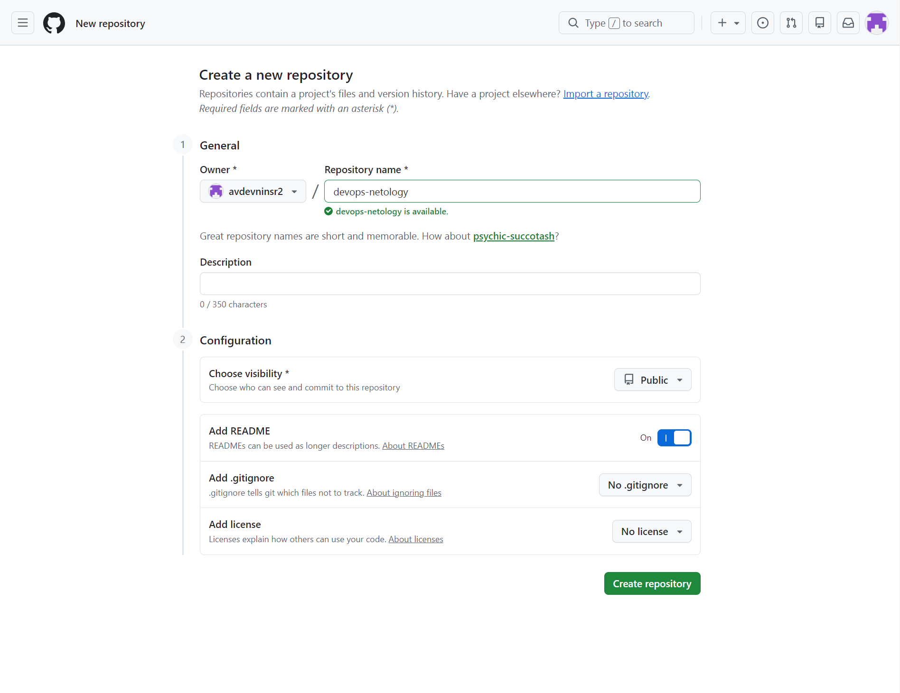 
Рисунок 1. Создание нового репозитория. 
Создание токенов представлено на рисунках 2, 3, 4 и 5. 

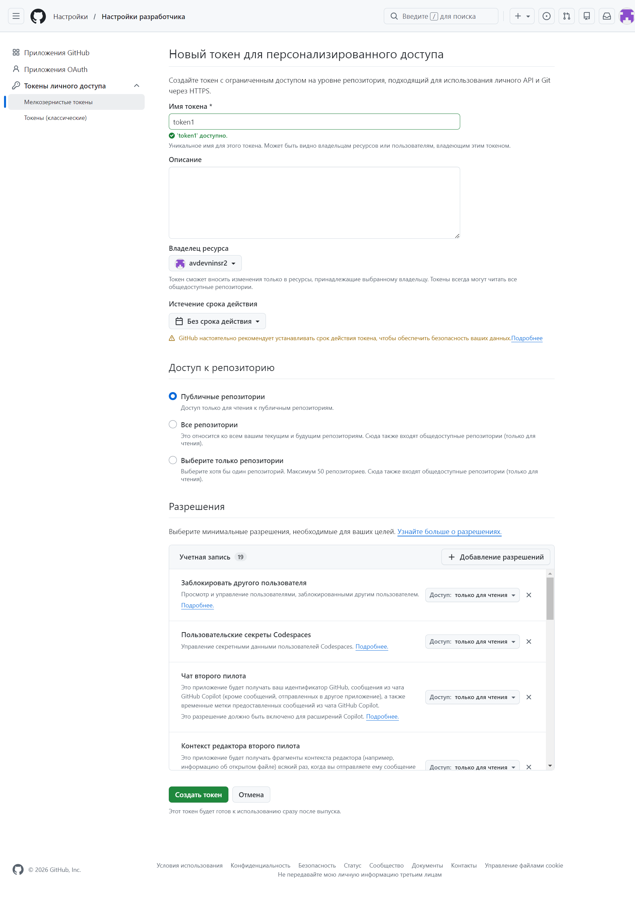 
Рисунок 2. Создание токена 1.

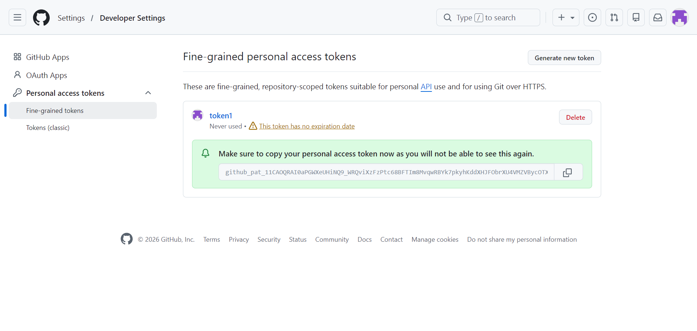 
Рисунок 3. Токен 1 создан.

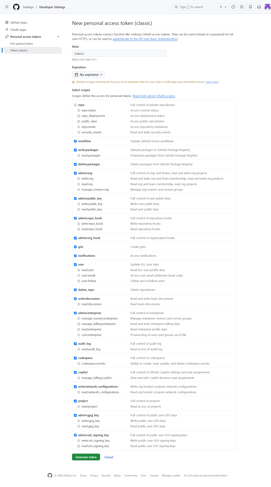 
Рисунок 4. Создание токена 2.

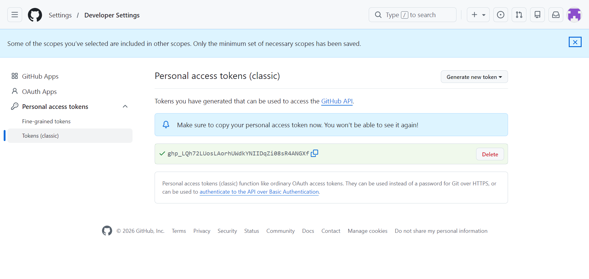 
Рисунок 5. Токен 2 создан. 
Клонирование репозитория представлены на рисунках 6 и 7 соответственно. 

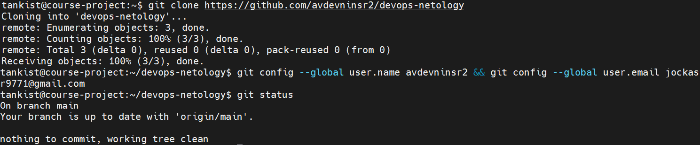 
Рисунок 6. Клонирование репозитория.

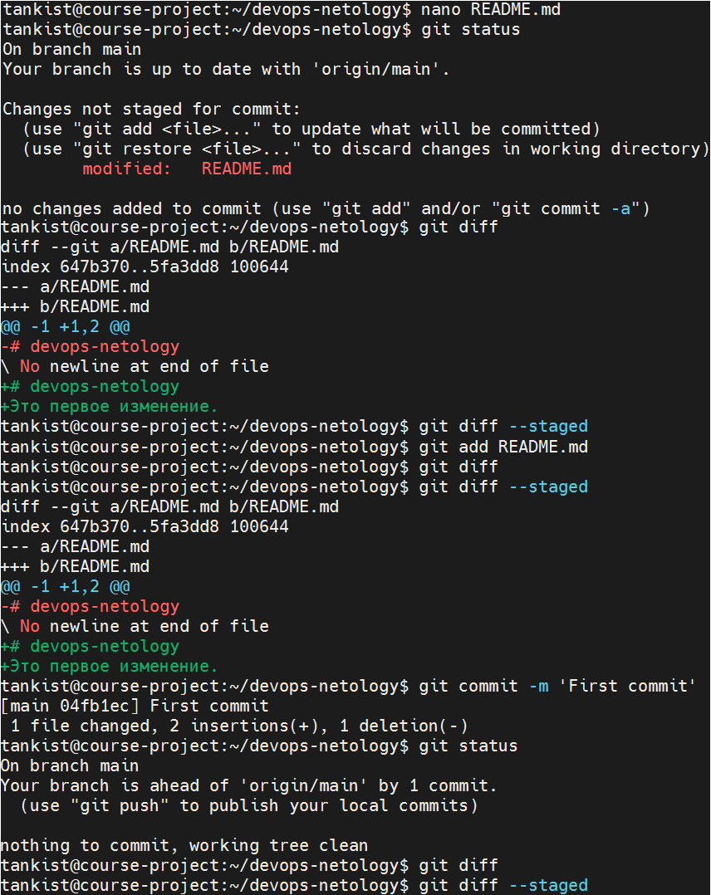 
Рисунок 7. Первый коммит. 

Создание файлов .gitignore и второго коммита представлены на рисунках 8 и 9 соответственно. 

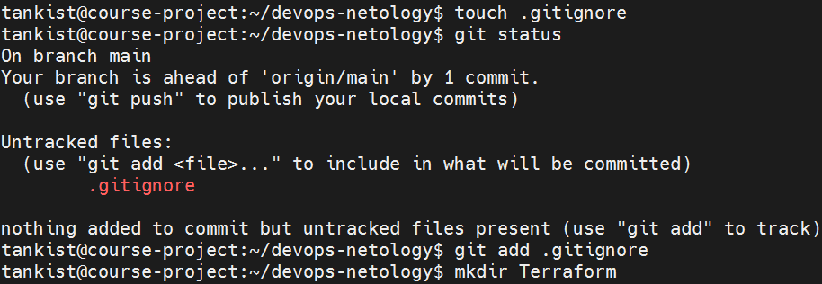 
Рисунок 8. Создание .gitignore. 

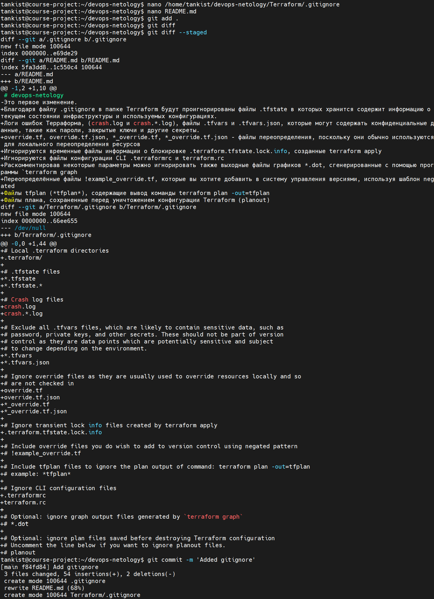 
Рисунок 9. Второй коммит. 
Будут проигнорированы данные типы файлов:
.tfstate - будут проигнорированы все файлы с расширением tfstate
*.tfstate.* - будут проигнорированы все файлы с расширением tfstate. (вместо звездочки ещё любое расширение)
crash.log - будут проигнорированы все файлы с именем crash и с расширением log
crash.*.log - будут проигнорированы все файлы с именем crash и с расширением *.log (вместо звездочки еще любое расширение)
*.tfvars - будут проигнорированы все файлы с расширением tfvars
*.tfvars.json - будут проигнорированы все файлы с расширением tfvars.json
override.tf - будут проигнорированы все файлы с именем override и с расширением tf
override.tf.json - будут проигнорированы все файлы с именем override и с расширением tf.json
*_override.tf - будут проигнорированы все файлы, в имени которых есть _override и с расширением tf
*_override.tf.json - будут проигнорированы все файлы, в имени которых есть *_override и с расширением tf.json
.terraformrc - будут проигнорированы все файлы, заканчивающиеся на .terraformrc
terraform.rc - будут проигнорированы все файлы с именем terraform и с расширением rc. 
Создание файлов will_be_deleted.txt (с текстом will_be_deleted) и will_be_moved.txt (с текстом will_be_moved) и их коммит представлены на рисунке 10. 

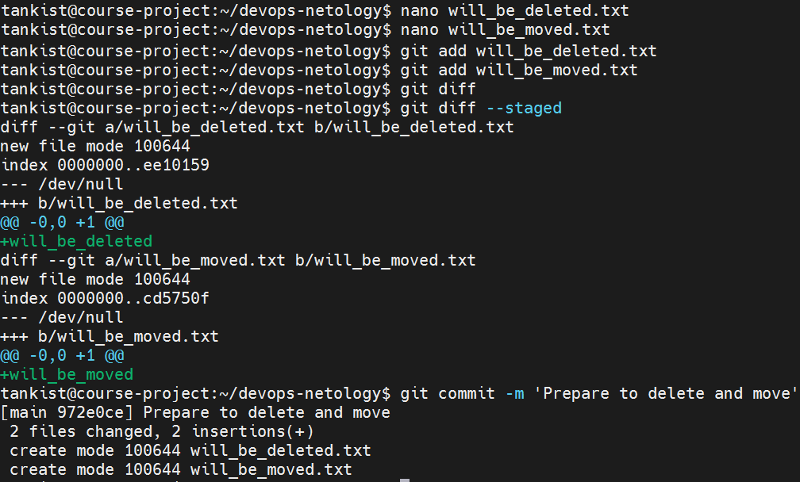 
Рисунок 10. Создание файлов will_be_deleted.txt (с текстом will_be_deleted) и will_be_moved.txt (с текстом will_be_moved) и их коммит. 
Действия над файлами will_be_deleted.txt и will_be_moved.txt и их коммит представлены на рисунке 11. 

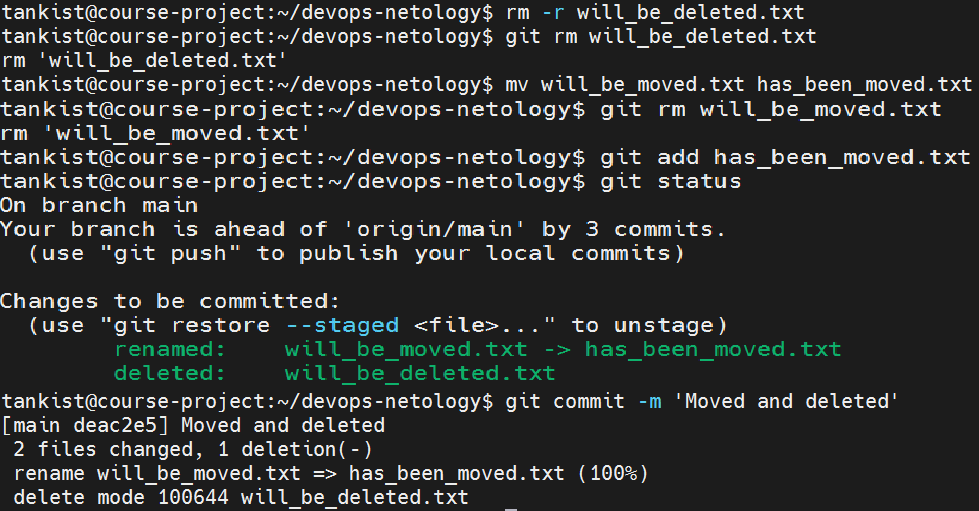 
Рисунок 11. Действия над файлами will_be_deleted.txt и will_be_moved.txt и их коммит. 
Проверка всех изменений представлена на рисунке 12. 

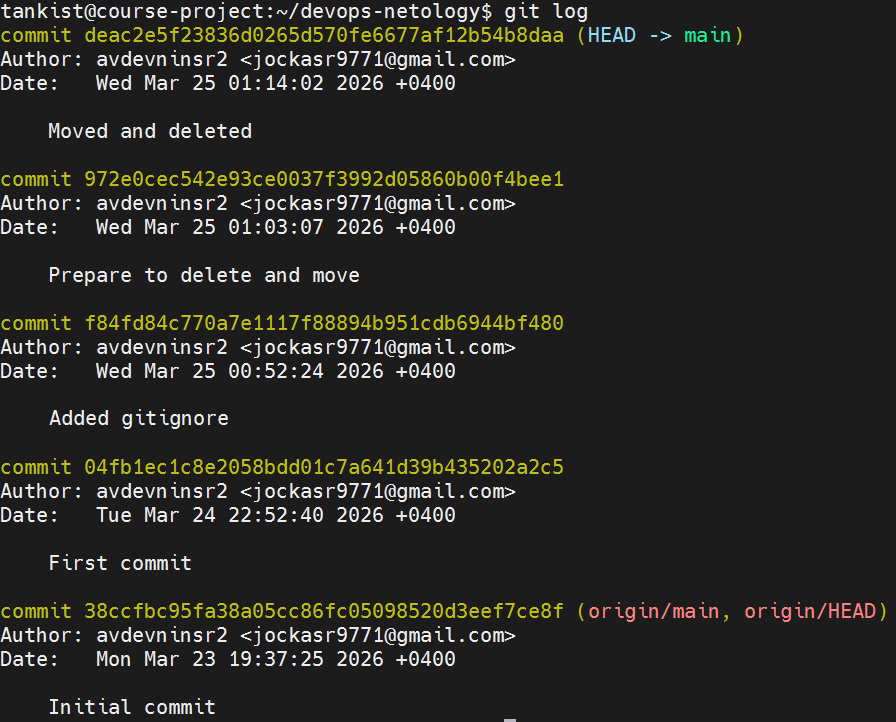 
Рисунок 12. Проверка изменений в репозитории. 
Отправка изменений в репозиторий представлена на рисунке 13. 

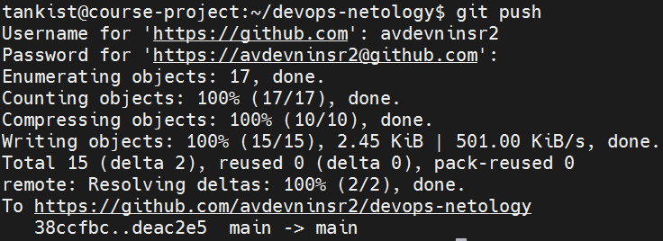 
Рисунок 13. Отправка изменений в репозиторий. 
[Созданный согласно заданию репозиторий.](https://github.com/avdevninsr2/devops-netology)
